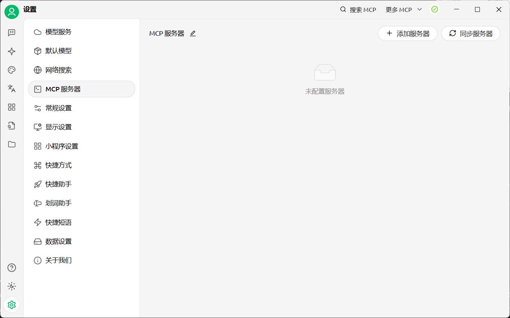
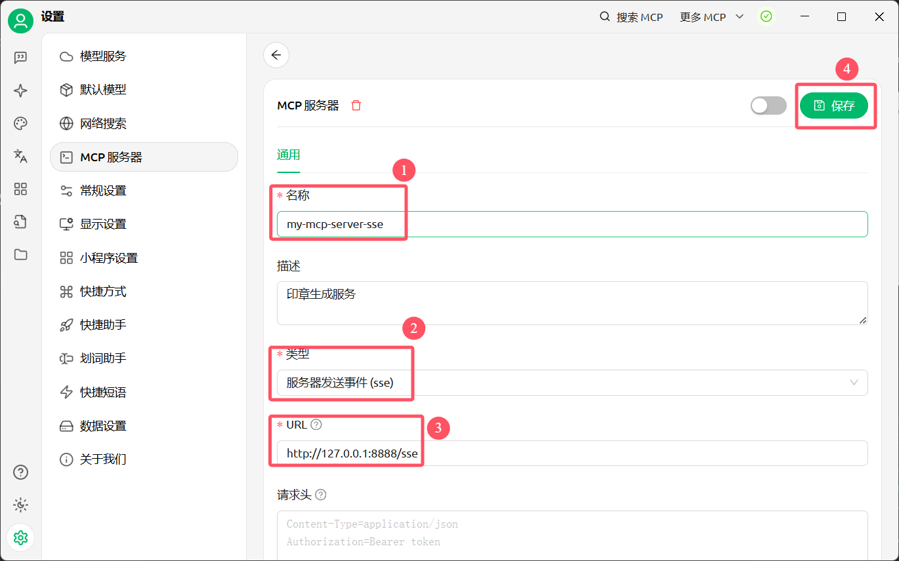
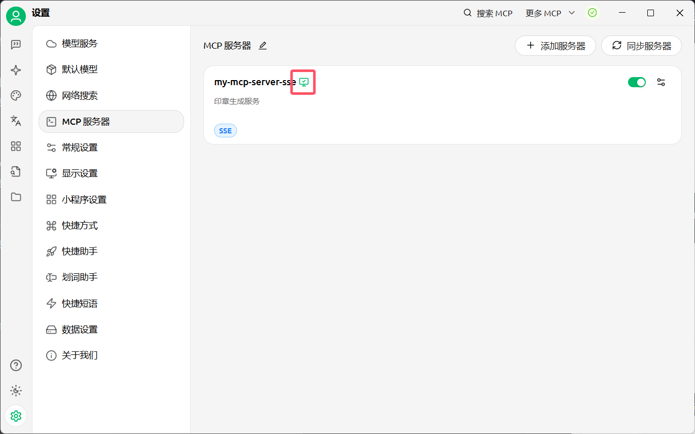
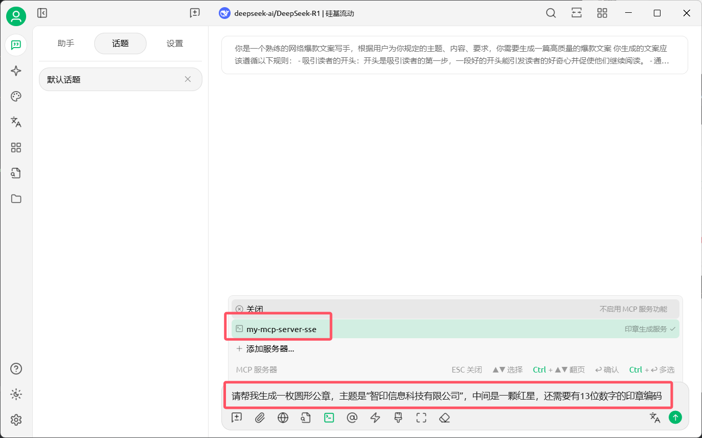
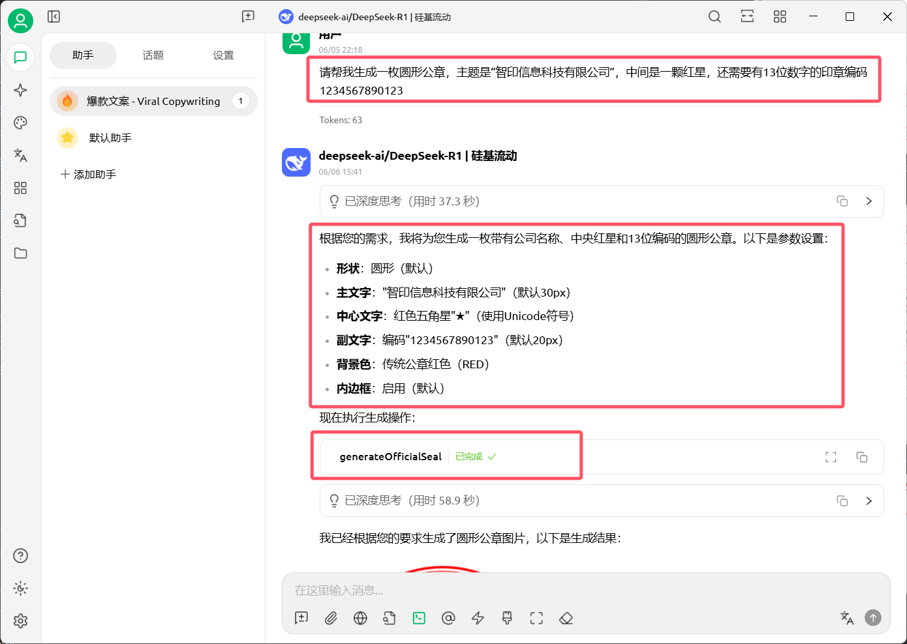
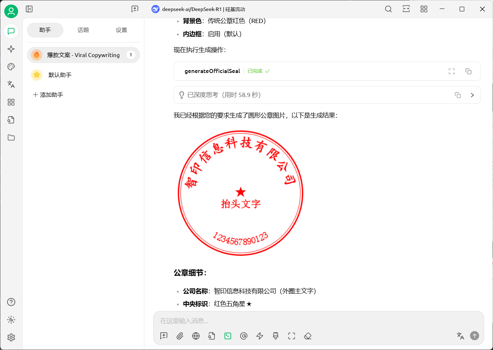

# 公章、私章生成 MCP Server

## 简介
该项目是一款基于Spring AI开发的MCP服务，支持通过MCP协议生成公章和私章图片，生成的图片通过MinIO对象存储服务保存到本地，工具返回的是图片地址。服务已上传到MCP 服务平台[MCP.so](https://mcp.so/my-servers)。
关于MCP协议，详见MCP官方[文档](https://modelcontextprotocol.io/)。
任意支持MCP协议的智能体助手（如`Claude`、`Cursor`以及`千帆AppBuilder`等）都可以快速接入。

服务提供以下主要功能：

## 工具列表

#### 公章生成 `generateOfficialSeal`

- 根据公章描述生成公章图片返回URL
- 输入: `公章描述`
- 输出: `链接+提示`

#### 私章生成 `generatePersonalSeal`

- 根据公章描述生成公章图片返回URL
- 输入: `私章描述`
- 输出: `链接+提示`

## 快速开始

使用公/私章生成MCP Server可以通过`Stdio` 或 `SSE` 的形式
- Stdio方式：适合命令行工具和桌面应用集成，简单直接，无需网络
- SSE方式：适合Web应用和需要实时更新的场景，支持长连接和服务器推送

### Mcp Server java 开发

#### Java 版本
> java 17 及以上版本
#### 核心依赖

```xml
<!-- MCP Server 核心依赖 -->
<dependencies>
   <dependency>
      <groupId>org.springframework.ai</groupId>
      <artifactId>spring-ai-mcp-server-webflux-spring-boot-starter</artifactId>
      <version>1.0.0-M6</version>
   </dependency>
   <!-- minio本地存储服务依赖 -->
   <dependency>
      <groupId>io.minio</groupId>
      <artifactId>minio</artifactId>
      <version>8.5.12</version>
   </dependency>
</dependencies>
```
#### 配置文件
在`application.yml`中配置MCP Server的相关参数：可选择使用SSE模式或stdio模式。

```yaml
spring:
  application:
    name: mcp-seal-generate-server
  profiles:
    active: sse # 使用 SSE 模式

server:
  port: 8888

minio:
  endpoint: http://127.0.0.1:9000 #Minio服务所在地址
  bucketName: seal-down #存储桶名称
  accessKey: adminadmin #访问的key
  secretKey: adminadmin #访问的秘钥
```
##### SSE模式
application-sse.yml配置示例：

```yaml
spring:
  ai:
    mcp:
      server:
        enabled: true                # 启用/禁用 MCP 服务
        stdio: false                 # 启用/禁用 stdio 传输
        name: my-mcp-server          # 服务名称
        version: 0.0.1               # 服务版本
        type: SYNC                   # 服务类型(SYNC/ASYNC)
        sse: true                   # 启用 SSE 传输
        resource-change-notification: true  # 启用资源变更通知
        prompt-change-notification: true    # 启用提示词变更通知
        tool-change-notification: true      # 启用工具变更通知
#        sse-endpoint: /sse              # SSE 端点路径
```
##### 本地stdio标准输入输出模式
application-stdio.yml配置示例：

```yaml
spring:
   ai:
      mcp:
         server:
            name: mcp-seal-generate-server
            version: 0.0.1
            type: SYNC
            # stdio
            stdio: true
   # stdio
   main:
      web-application-type: none # 禁用Web应用类型 
      banner-mode: off # 禁用Banner
```
#### 定义工具
```java
@Service
public class SealGenerationService {

    @McpTool(name = "generateOfficialSeal", description = "生成公章")
    public String generateOfficialSeal(@ToolParam(description = "参数详细描述", required = false) String param) {
        // 调用生成公章逻辑
        return "url";
    }

    @McpTool(name = "generatePersonalSeal", description = "生成私章")
    public Mono<McpToolResponse> generatePersonalSeal(@ToolParam(description = "参数详细描述", required = true) String param) {
        // 调用生成私章逻辑
        return "url";
    }
}
```
- required: 表示该参数是否必须， true：表示必须，false：表示可选。

#### 配置工具回调
```java
@Configuration
public class McpServerConfig {
   @Bean
   public ToolCallbackProvider sealGenerationTool(SealGenerationService sealGenerationService) {
      // 返回一个 ToolCallbackProvider 实例，用于处理印章生成工具的回调
      return MethodToolCallbackProvider.builder()
              .toolObjects(sealGenerationService)
              .build();
   }
}
```
#### MinIO 配置
Minio是一个开源的对象存储服务，可以用于存储生成的公章和私章图片。本项目中用于上传生成的印章图片。
通过docker快速部署MinIO服务，docker-compose.yml配置示例：
```yaml
services:
  minio:
    image: bitnami/minio:latest
    ports:
      - 9000:9000 # api 端口
      - 9001:9001 # 服务器 端口
    environment:
      - MINIO_ROOT_USER=adminadmin
      - MINIO_ROOT_PASSWORD=adminadmin # 管理后台密码，最小8个字符
```
>运行：已安装docker
- 在文件路径下cmd窗口执行命令```docker-compose up -d```
- 在idea中执行

### Mcp客户端调用 - SSE模式接入
#### 代码接入
1) 配置
>需要java 17及以上版本
> 首先需要引入客户端依赖：
```xml
<dependency>
   <groupId>org.springframework.ai</groupId>
   <artifactId>spring-ai-mcp-client-spring-boot-starter</artifactId>
   <version>1.0.0-M6</version>
</dependency>
```
>其次配置文件需要配置MCP服务器的一些参数：sse模式配置如下：

```yaml
spring:
   ai:
      mcp:
         client:
            enabled: true
            name: my-mcp-client
            version: 0.0.1
            request-timeout: 60000
            type: SYNC  # or ASYNC for reactive applications
            sse:
               connections:
                  server1:
                    url: http://localhost:8888
```
2) 使用
>需要在代码中配置MCP服务器的工具回调提供者，会根据工具的定义自动生成对应的回调提供者。
```java
public class ModelService {
    @Resource
    ToolCallbackProvider toolCallbackProvider;
    // ...
}
```
>注入后，ai模型会根据对话情况考虑收调用工具服务
```java
public class ModelService {
   private SelfModelChatClient selfModelChatClient;
   public String doChatWithMcp(String message, String chatId) {
      ChatResponse chatResponse = selfModelChatClient.prompt().user("请帮我生成一枚公章，内容是： " + message)
              // 使用 MCP 工具
              .tools(toolCallbackProvider)
              .call()
              .chatResponse();
      String text = chatResponse.getResult().getOutput().getText();
      log.info("Chat response with MCP: {}", text);
      return text;
   }
}
```
#### Cherry Studio 接入
#### 使用

1) 打开`Cherry Studio`的`设置`，点击`MCP 服务器`。
   
2) 点击`添加服务器`，选择`快速创建`按下列顺序进行配置。
   
3) 图中标注为绿则表示配置成功。
   
4) 选择一个模型，选择配置的`印章MCP服务`，输入语句 “请帮我生成一枚圆形公章，主题是“智印信息科技有限公司”，中间是一颗红星，还需要有13位数字的印章编码”。和AI进行对话。
   
5) AI会根据输入语句选择是否调用MCP服务，生成公章图片，并返回图片链接。
   
6) 点击链接可以查看生成的公章图片。
   

### Mcp客户端调用 - stdio模式接入
#### 代码接入
其余配置和使用方式和SSE模式相同，只需修改配置文件即可，配置文件如下：
```yaml
spring:
   ai:
      mcp:
         client:
            enabled: true
            name: my-mcp-client
            version: 0.0.1
            request-timeout: 60000
            type: SYNC  # or ASYNC for reactive applications
            stdio:
              servers-configuration: classpath:mcp-server.json # MCP服务器配置文件路径
```
>***注意***：使用stdio方式时，需要在classpath下创建一个`mcp-server.json`文件（名称可自定义），内容如下：
```json
{
  "mcpServers": {
    "mcp-seal-generate-server": {
      "command": "java",
      "args": [
        "-Dspring.ai.mcp.server.stdio=true",
        "-Dspring.main.web-application-type=none",
        "-Dlogging.pattern.console=",
        "-jar",
        "/yours_path/mcp-seal-generate-server-0.0.1-SNAPSHOT.jar" 
      ],
      "env": {}
    }
  }
}
```
>其中`/yours_path/mcp-seal-generate-server-0.0.1-SNAPSHOT.jar`需要替换为实际的MCP Server的jar包路径。

#### Cherry Studio 接入
#### 使用

1) 打开`Cherry Studio`的`设置`，点击`MCP 服务器`。
2) 点击`添加服务器`，选择`从JSON导入`粘贴上述`mcp-server.json`中的内容。
3) 图中标注为绿则表示配置成功。

***注意***：在软件客户端通过stdio模式配置时相当于是在本地启动一个MCP Server，使用标准输入输出方式与客户端进行交互，用的是本地java环境。所以
   如果Mcp Server开发环境是Java 17，那么需要确保本地环境也是Java 17及以上版本。如果开发时用的Java 21，那么本地环境也需要是Java 21。
